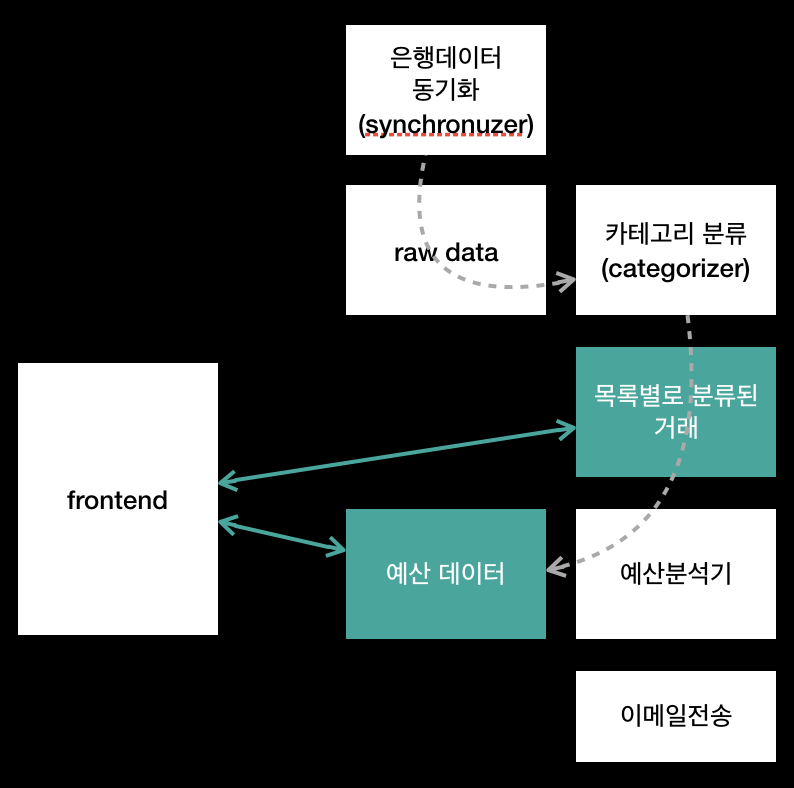
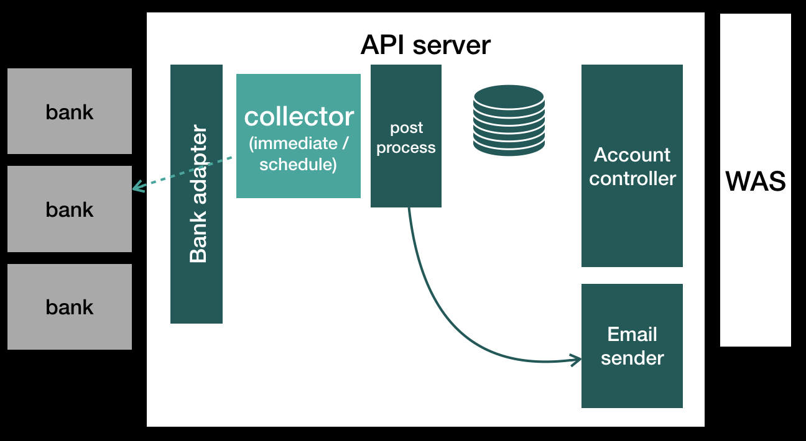

# 시스템 설계 및 규모 확장성

### 시스템 설계
(tinyURL시스템 설계를 에로 든다.)
1) 문제의 범위를 한정하라. 
e.g.) 개개인이 원하는 대로 축약된 URL을 만들 수 있는가, 클릭에 관한 통계정보를 기록할 필요가 있는가
2) 합리적인 가정을 만들어라
e.g.) 하루에 최대 백만개의 URL을 생성한다.
3) 중요한 부분을 먼저 그려라. (다이어그램으로 표현)
4) 핵심 문제점을 찾으라
  - 어느 지점이 병목지점일까?

### 규모확장을 위한 알고리즘
1) 현실적 제안을 무시하라.
  - 메모리 제약이 없고, 컴퓨터 한 대에서 모든 데이터를 다 처리할 수 있다고 가정하고 접근
2) 현실로 돌아오라.
  - 데이터를 여러 조각으로 쪼갰을 때 어떤 문제가 발생할까 / 어떤 논리로 데이터를 나눌까 / 특정 컴퓨터가 어느 데이터 조각을 사용했는지 어떻게 알 수 있을까

## 시스템 설계의 핵심 개념
### 수평적(horizontal) vs 수직적(vertical) 규모확장성
- 수직적: 특정 노드의 자원을 늘림. (메모리 혹은 디스크만)
- 수평적: 노드의 개수를 늘리는 방법. (부하를 줄인다)
### 데이터베이스 분할(샤딩)
- **수직적 분할**: 자료의 특성 별로 분할. 특정 테이블의 크기가 일정 수준 이상으로 커지면, 재분할 필요.
  - e.g.) 개인정보와 관련된 부분에 따라 자료를 분할
- **키 혹은 해시 기반 분할**: mod(key,n)의 값을 이용해서 N개의 서버에 분할 저장. 서버를 새로 추가할 때마다 모든 데이터를 다시 재분배해야한다.
- **디렉터리 기반 분할**: 데이터를 찾을 때 사용되는 조회테이블(lookup table)을 유지. 조회테이블이 single point of failure이 될수 있고, 지속적으로 테이블을 읽는 행위가 전체 성능에 영향을 미칠 수 있다.
### MapReduce
- Map: 데이터를 입력으로 받은 뒤 <key, value> 쌍을 반환한다
- Reduce: key, value를 입력으로 받은 뒤 나름의 처리과정을 거친 뒤 새로운 키와 값을 반환한다. 경우에 따라 이 결과를 또다른 Reduce프로그램에 넘길 수도 있다.

9.1 주식데이터: {시작가, 종가, 최고가, 최저가}를 1000개의 클라이언트가 사용할수 있게 데이터를 제공하는 방법 설계
[DB] - [WAS] - client 로 구현 (WAS에서 권한에따라, 제공해주고 싶은 정보만 추려서 json으로 리턴해준다.)

9.2 소셜 네트워크: 두 사람 사이의 최단경로를 보여주는 알고리즘 설계
BFS로 찾는데, 두 사람을 모두 큐에 넣어서 탐색한다. 방문한 지점을 Friend[] V (Friend{ boolean fromA, boolean fromB}) 로 관리하며 fromA, fromB가 모두 true일 경우 큐를 종료한다.  
경로를 출력하기 위해 큐에 넣을때마다 int[] Parent 값도 같이 저장하여 거꾸로 타고 올라간 경로를 머지한다.

9.3 웹에 있는 크롤러를 설계할 때 무한루프에 빠지지 않으려면? 같은페이지인지 어떻게 구분을 할것인가?
- BFS로 탐색하되 이미 방문한 페이지는 표시한다.
- 웹페이지가 지원하지 않는 쿼리의 경우에는 같은 페이지로 리다이렉트된다. 그러면 단순히 내용과 Url을 비교하면될까?
- 랜덤으로 렌더링 되는 페이지의 경우에는 이것도 사용할 수 없다.
- 내용의 일부와 Url을 사용하여 '시그니처 값'을 만들어 비교한다.
- 캘린더와같이 날짜별로 링크가 있는 경우에는 그 안에서 계속 루프를 돌기때문에 메타정보로 접근횟수/유효데이터/쓰레기데이터와 같은 메타데이터를 같이 수집한다.
(https://lyb1495.tistory.com/104)

9.4 10억개의 URL이 있을때 중복을 어떻게 검사할까?
- URL을 hashmap으로 메모리에 올린다. 평균 100문자라고 하면 4바이트 * 100 = 400byte, 400 * 100억 = 4,000,000,000,000 = 4테라
- mod(hash, N)으로 N개의 파일에 저장한다.
- N개의 파일 대신 N개의 서버에 저장한다. (서버에 장애가 생길 경우? 고민)

9.5 검색 엔진에서 최근 검색 요청을 캐시에 저장하는 매커니즘 설계. processSearch는 아주 고비용이다. 데이터가 바뀌었을때 어떻게 캐시를 갱신할것인가
1) 검색 결과는 url의 array list로 표현한다.
2) 각 url이 최신인지 여부를 저장한다.
- boolean isLatest[] = true
- 데이터가 바뀌었을때 isLatest = false로 표햔하며, 검색이 되는 시점에 false인 값이 하나라도 있으면 캐시를 갱신한다.
3) {검색 쿼리: 결과}를 해시테이블로 캐시에 저장한다. 
- 캐시에서 결과를 꺼내줄때 검색 결과 중 isLatest의 값이 false가 하나라도 있는지 매번 검사해야겠네...
- 해시테이블에 생성 날짜 항목도 같이 넣고 찾을때마다 날짜를 업데이트 해주면서 pq로 정렬을 계속 해야겠다..

sol)
1) 단일 시스템에 대한 캐시 설계
- 캐시 구조
  - 연결리스트: 오래된 데이터를 쉽게 제거할 수 있다. 최근에 검색된 애는 맨 앞으로 이동시키고, 리스트가 꽉 찼을 때 맨 뒤의 데이터를 지우면 된다.
  - 해시테이블: 데이터를 효율적으로 탐색할수있다. 오래된 데이터를 지우기 힘들다. 
  => 연결리스트 + 해시테이블
- 연결리스트에서 각각 expired time을 갖고 있으면 조회시점에 expired 된 애만 새로 조회한다. Data가 업데이트 된

2) 여러 서버로 확장
- 각 서버에서 캐시를 따로 관리해야할까? 최적화가 안된다.
- 그럼 각 서버에 캐시 복사본을 둘까? 캐시를 갱신할 때 마다 N개의 클러스터로 전송해야한다. && 캐시에 저장가능한 항목수가 줄어든다.
- mod(hash(쿼리)%서버갯수)의 값대로 서버에 저장한다:어느 서버에 있는지 알아내야하고 그 서버에서 다시 캐시값을 가져와야한다. 반대로 저장할때에도 같은 순서로 처리해야 하기때문에 서버간 호출이 늘어난다.
* URL이 갱신되었을때는 어떻게 처리할것인가?
- 그냥 일정 시간이 지나면 캐시에서 삭제해버린다.
- 최적화: 데이터의 종류에 따라 삭제 주기를 다르게 한다. (e.g. 뉴스데이터는 과거 주식데이터보다 더 자주 갱신된다.)

9.6 판매 순위: 어떤 상품은 전체 제품 중에서 1,506번째로 잘팔리지만 운동 장비중에서는 13번째로 잘팔리고, 안전용품 중에서는 24번째로 잘팔린다. 이 시스템을 어떻게 설계할 것인가
- 전체 제품 갯수가 N개로 고정되어있다고 가정한다
- `Square root decomposition (평방분할)`을 사용하면 어떨까
(가격으로 구간을 나누고) 내 구간안에서만 각 카테고리별로 몇등인지 알면 된다. 내 이전 구간에서 각 카테고리별로 누적 갯수를 갖고 있으면.. 그거 + 내 카테고리안에서 등수를 더하면 될거같다.
-----|-----| ~~~ | ~~~
A:5개 |     | 
B:2개 | 내꺼 |
C:3개 |     

sol)
아래와 같이 가정을 한다.
- 인기 있는 제품은 1시간마다 데이터를 갱신하며, 아닌애들은 하루전의 데이터일 수 있다
- 시간범위는 지난 7일(정확할 필요는 없다)간의 데이터를 기준으로 한다.
1) DB테이블 스키마를 아래와 같이 설계한다. 환형배열과 같이. 
그리고 두 테이블을 join한다.
[제품 ID / 총량 / 일 / 월 / 화 / 수 / 목 / 금 / 토 ], [제품 ID / 목록 ID]
- DB에 데이터를 기록하기전에 로그/캐시 데이터를 모아서 한번에 넣자. (정해진 시점에)
2) join은 비용이 비싸다.
[제품 ID / 목록 / 총량 / 일 ... 토 ] 로 저장하여 목록 + 총량으로 정렬하여 순위를 얻을 수 있다. 
3) 꼭 DB를 사용하지 않고도 한 제품을 모든 목록directory에 파일로 쓴다. 그리고 각 목록에서 가장 잘팔리는 제품은 목록별로 정렬하기만 하면 된다.
전체 순위는 (1) general목록 디렉토리를 만들거나 (2) 각 목록의 제품 판매량을 정렬한 데이터를 merge를 한다.
가장 인기 있는 제품 100개는 각 목록별로 인기있는 제품을 2개씩 merge한다. 흠~~

* 추가
아래와 같이 스키마정보를 저장해두면 1) 전체 순위(제품id로 groupby하여 sorting), 2) 카테고리별 순위(제품id로 groupby, 카테고리로  filter) 모두 구할 수 있다. + 날짜구간도 where절로..
날짜(2019/1/1) / 제품id / 카테고리
20190101 / 101 / 운동
20190101 / 101 / 먹는것
...

+ 추가로 고민해봐야할 문제들
- 병목현상은 어디서 나타날까?
- 하위 목록이 있다면 어떻게 할것인가? 스포츠 > 스포츠용품 > 테니스 > 라켓
- 데이터가 좀더 정확해야한다면? 적어도 30분이내 갱신된 것이어야 한다면?

9.7 계정관리시스템을 어떻게 설계할까? 은행게정과 연동되어 있어야 하며 소비습관을 분석하고 그에맞게 적절하게 추천할 수 있어야 한다.
1) 문제의 범위 한정하기
- N개의 은행 계좌를 추가할수있다.
- 금융기록은 제품의 카테고리와 함께 전달된다.
- 카테고리는 수정가능하다.
- 예산을 설정할 수 있다. (메인기능은 아니다)
- 웹사이트를 가정하고 있지만 모바일앱에 대해서도 이야기할 수 있다.
- 이메일 공지사항을 주기적으로 받거나 특정한 경우에만 받아볼 수 있다(e.g. 지출액이 특정 한계점을 넘었다든가, 주어진 예산을 최대로 사용했다든가)
- 카테고리는 판매자의 이름으로 정한다.
2) 합리적인 가정하기
- 은행 계좌를 추가/삭제하는건 상대적으로 흔하지 않다.
- 많은 사람들이 하루에 여러번 거래를 하지만 주로 이메일 공지를 받고 나서 시스템에 접속한다.
- 은행데이터를 직접 요청해야 한다.
- 예산을 넘어선 경고메일은 즉시 보내지 않아도 된다.
3) 주요 구성요소 그리기

- 새로운 데이터는 raw data다. 이후에 목록별로 분류한다,
- 예산분석기는 목록별 거래 데이터를 가져와서 사용자+목록별 예산을 갱신/저장한다.
4) 핵심 문제 파악하기
- 데이터를 많이 사용하므로 비동기 처리를 많이 할 수 있는 시스템이어야한다(작업 큐, 우선순위)
- 이메일시스템: 초과할 경우에만 큐에 add 한다
- 자주 사용하지 않는 사용자: 유령유저(우선순위 낮게 설정)
- 거래내역을 DB가 아닌 **파일**로 저장 (판매자 이름 별로 저장)
- categorizer: 판매자 이름별로 저장된 거래를 유저별로 분류한다.
- 사용자가 카테고리를 변경한 경우 예산분석기를 다시 돌린다.

9.8 텍스트를 입력하면 접속가능한 임의의 URL을 생성한 뒤 반환해주는 시스템을 설계해라.
1) 문제의 범위 한정하기
- 문서의 수정은 지원하지 않는다.
- 각 페이지에 얼마나 많이 접근했는지에 대한 분석 결과를 알고 있다.
- 오랫동안 접속하지 않으면 자동으로 삭제한다.
- 사용자가 문서의 URL을 쉽게 유추할수없다.
- 각 URL에 대한 분석 결과는 각 페이지의 stats링크를 통해 볼 수 있다.
2) 합리적인 가정
- 문서에 대한 요청은 균등하지않다.
- 시스템은 수백만개의 문서에 대한 요청을 처리해야한다.
3) 주요 구성요소 그리기
- 검색기능을 제공할 필요가 없으므로 {URL-문서}는 파일로 저장한다.
- 통계자료는 DB에 저장한다. (timestamp, IP주소, 방문기록에 대한 통계자료)
4) 핵심문제 파악하기
- 자주 접근하는 특정 문서는 캐시에 저장한다.
- 데이터 샤딩은 mod(hash)으로 할수있다.
- URL생성: 문자와 숫자로 이루어진 길이가 10인 수열을 생성. 36^10이니까 거의 충돌하지 않지만 이미 존재하는지는 확인해봐야한다.
